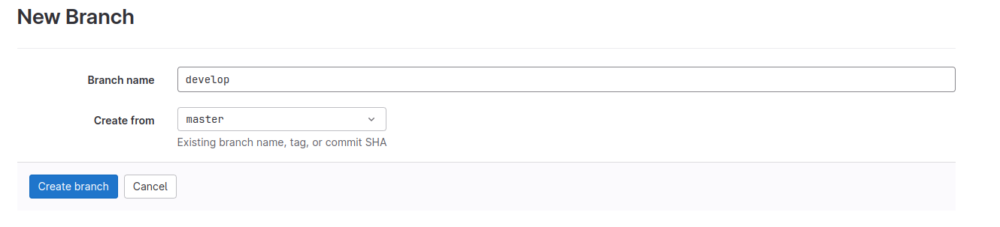
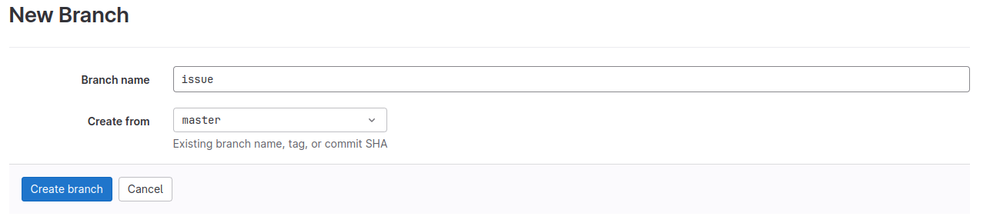

1) Создание личного репозитория с .gitignore и простым README.md

2) Создание веток develop и master

3) Установка ветки develop по умолчанию

4) Создание issue на создание текущего мануала

5) Создание ветки по issue

6) Создание merge request по ветке в develop
7) Комментирование и принятие реквеста
8) Формирование стабильной версии в master с простановкой тега
9) Работа с wiki проекта